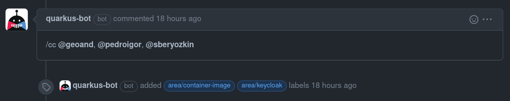

## "Death by a thousand paper cuts"

-

## Triage

* Flux constant d'issues et de pull requests
* Beaucoup de composants avec des mainteneurs différents
* Besoin de pinger les bons interlocuteurs

-

## Affecter les milestones

* ~ 200 issues / pull requests sans milestone le jour de la release
* Equipe hétérogène → process moins suivi

-

## Difficile de trouver la cause quand erreur CI

-

## En un mot: mise à l'échelle

Nous devons résoudre ce problème.
Plutôt hier qu'aujourd'hui.

---

## Quarkus GitHub Bot

* A l'origine, un petit bot Probot
* Migration vers Quarkus
* Et on est allé beaucoup plus loin ! Par exemple...

-

## Triage automatique

-

## Workflow automatisé

-

## Rapport de build automatisé

-

## Annotations

@Notes:

Développer combien c'est important pour nous aujourd'hui,
combien il nous manque quand inactif,
et comment nous l'avons déployé sur d'autres projets dans l'écosystème Quarkus.
