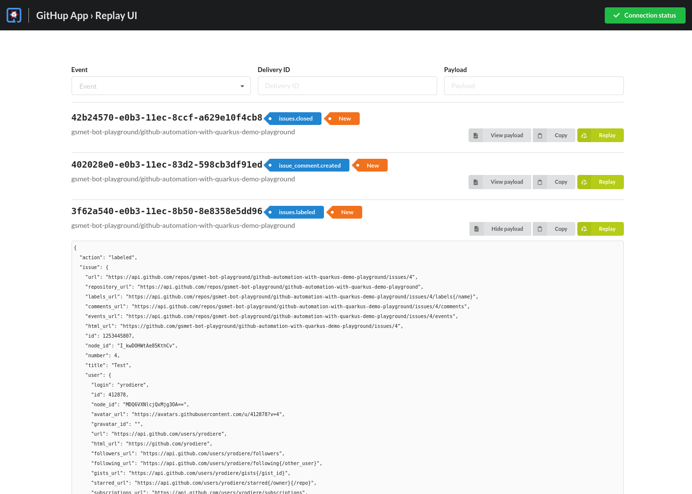

## Vous voulez le vôtre ? Facile !

-

## Quarkus GitHub App

* Extension Quarkus
  * Développez des GitHub Apps en Java
  * Zéro code inutile
  * Compilation native GraalVM
* Stable - en production depuis 2 ans
* Supporte aussi GitHub Enterprise
* Soyez créatifs, créez votre propre bot !

@Notes:

* What we're going to present to you is called [...]
* It's a Quarkus extension:
  takes advantage of all the power of Quarkus to provide [...]
* Gets all sorts of advantages from Quarkus, for ex. native
* Not a prototype
* GH enterprise if you need it
* Most importantly: it's not a bot, it's a library.
  So you can be creative, [...]

-

<!-- .element data-background="images/tweet-close-osgi-tickets.png" data-background-size="auto" -->

-

<!-- .element data-background="images/github-automation-with-quarkus-demo-time.svg" data-background-size="contain" -->

-

<!-- .element data-visibility="hidden" -->

## Replay UI

-

## En résumé

* Quarkus !
  * Developer joy: live reload...
  * CDI, persistence, Kafka...
* GitHub !
  * Hub4j GitHub API très complète
* Et bien plus !
  * Annotations d'événements
  * Configuration dans le repository
  * Replay UI
  * Framework de test basé sur Mockito

-

## Et c'est documenté

https://quarkiverse.github.io/quarkiverse-docs/quarkus-github-app/dev/index.html

@Notes:

* You get Quarkus, with [...]
* You get GitHub, with [...]
* You get more than that, with [...]
* You get all that! \[link with Guillaume: "And actually you get even more!"]