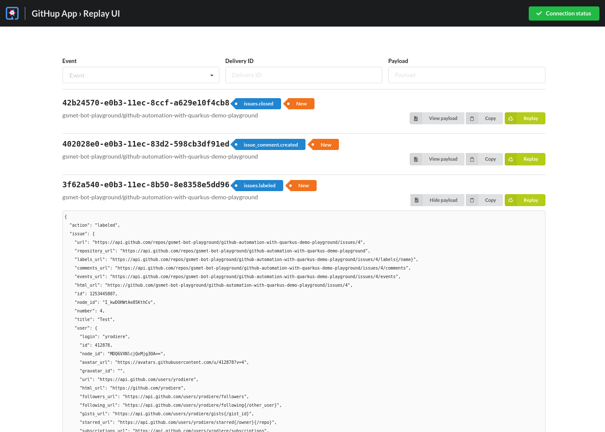

## Want your own? Easy-peasy!

-

## Quarkus GitHub App

* Quarkus extension
  * Develop GitHub Apps in Java
  * Zero boilerplate
* Stable - in production for 3 years
* Supports GitHub Enterprise too
* Be creative, create your own bot!

@Notes:

* What we're going to present to you is called [...]
* It's a Quarkus extension:
  takes advantage of all the power of Quarkus to provide [...]
* Gets all sorts of advantages from Quarkus, for ex. native
* Not a prototype
* GH enterprise if you need it
* Most importantly: it's not a bot, it's a library.
  So you can be creative, [...]

-

<!-- .element data-background="images/tweet-close-osgi-tickets.png" data-background-size="auto" -->

-

<!-- .element data-background="images/github-automation-with-quarkus-demo-time.svg" data-background-size="contain" -->

-

<!-- .element data-visibility="hidden" -->

## Replay UI

-

## Fully documented!

https://docs.quarkiverse.io/quarkus-github-app/dev/

-

## In short

* Quarkus!
  * Developer joy: live reload...
  * CDI, persistence, Kafka...
  * Native compilation
* GitHub!
  * Extensive Hub4j GitHub API
* More!
  * Event annotations
  * Configuration in the repository
  * Replay UI
  * GraphQL client
  * Mockito-based test framework

@Notes:

* You get Quarkus, with [...]
* You get GitHub, with [...]
* You get more than that, with [...]
* You get all that! \[link with Guillaume: "And actually you get even more!"]