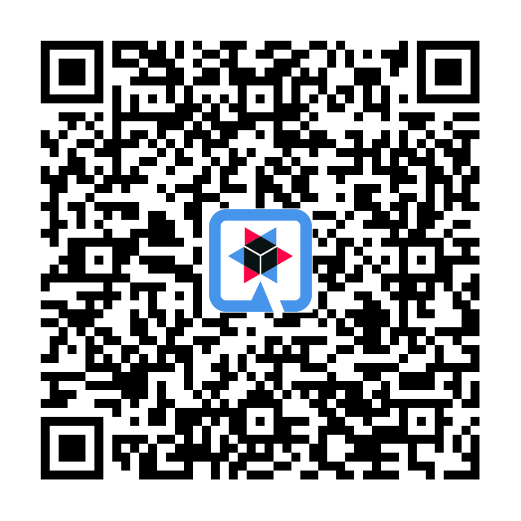

## Automation vs paper cuts

* Small paper cuts add up
* Automation streamlines your work
* Quarkus GitHub App and Quarkus GitHub Action can help, quick and easy
* Start small, put in production, and grow from there

@Notes:

* [...]: with a large enough project, even small inconveniences can really slow you down
* [...]: it's a chance to offload plenty of small (or not so small) tasks
* [...]: familiar environment and no boilerplate,
  so you don't spend more time on automation than you would have manually.
* Also means even a small GitHub app is worth it: you can start small [...]

-

## Extensions?

* These extensions are small
* Everything is wired during the build with Gizmo
* Custom extensions are powerful and bring developer joy

@Notes:

* [...] Quarkus is all about: making your life easier
* [...] develop extensions like this one

-

<!-- .element: class="grid" -->
## Thanks for listening!

https://xkcd.com/1319/

-

## Resources

* Quarkus GitHub App - <https://github.com/quarkiverse/quarkus-github-app>
  * 📘 <https://quarkiverse.github.io/quarkiverse-docs/quarkus-github-app/dev/>
* Quarkus GitHub Action - <https://github.com/quarkiverse/quarkus-github-action>
  * 📘 <https://quarkiverse.github.io/quarkiverse-docs/quarkus-github-action/dev/>
* Quarkus GitHub Bot - <https://github.com/quarkusio/quarkus-github-bot>

-

<!-- .element data-visibility="uncounted" -->

## Architecture

-

<!-- .element data-visibility="uncounted" -->

### License

Logos in this presentation are trademarks or registered trademarks of their respective owners in the United States and other countries.

The copyright of the "Automation" comic on the "Thanks for listening!" slide is owned by Randall Munroe (author of [xkcd](https://xkcd.com/1319/)),
who licenses the comic under the [Creative Commons Attribution-NonCommercial 2.5 License](https://creativecommons.org/licenses/by-nc/2.5/).

The rest of this presentation is distributed under CC-BY-4.0.
See https://creativecommons.org/licenses/by/4.0/ for details.

The source code for this presentation is available at https://github.com/gsmet/talks/.
