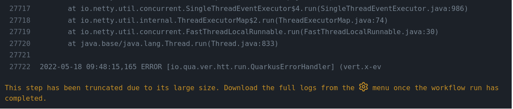

## "Death by a thousand paper cuts"

-

## Triaging

* Constant flow of issues/pull requests
* Many components with different maintainers
* Need to ping appropriate people

-

## Affecting milestones

* ~ 200 issues / pull requests without milestone when releasing
* Heterogeneous team makes it harder

-

## Hard to find cause when CI fails

-

## In one word: scale

We need to solve this issue. Fast.

---

## Quarkus GitHub Bot

* Started as a Probot bot
* Switched to Quarkus
* Went way beyond! For example...

-

## Automated triaging

-

## Automated workflow

-

## Automated build report

-

## Annotations

