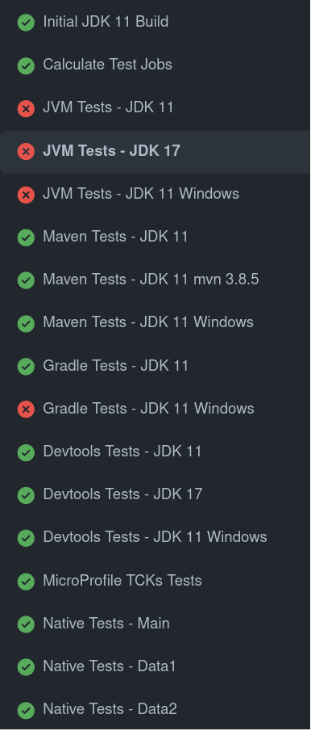
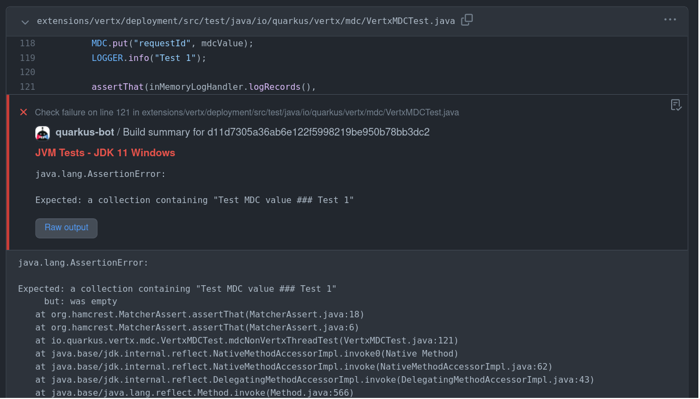

## "Death by a thousand paper cuts"

-

## Triaging

* Constant flow of issues/pull requests
* A lot of components with different maintainers
* Need to ping appropriate people

-

## Affecting milestones

* ~ 200 issues / pull requests without milestone when releasing
* So much fun affecting the milestone manually for each of them
* Heterogeneous team makes it harder

-

## Hard to find cause when CI fails

-

## In one word: scale

* We need to solve this issue. Fast.

-

## Quarkus GitHub Bot

* Started as a Probot bot
* Once we had sufficient feedback...
  * Started the Quarkus GitHub App extension
  * Ported all the existing features... and more!
* A loooot of features, including...

-

## Automated triaging

-

## Automated workflow

-

## Automated build report

That's where switching to Java really paid off!

-

## Annotations

